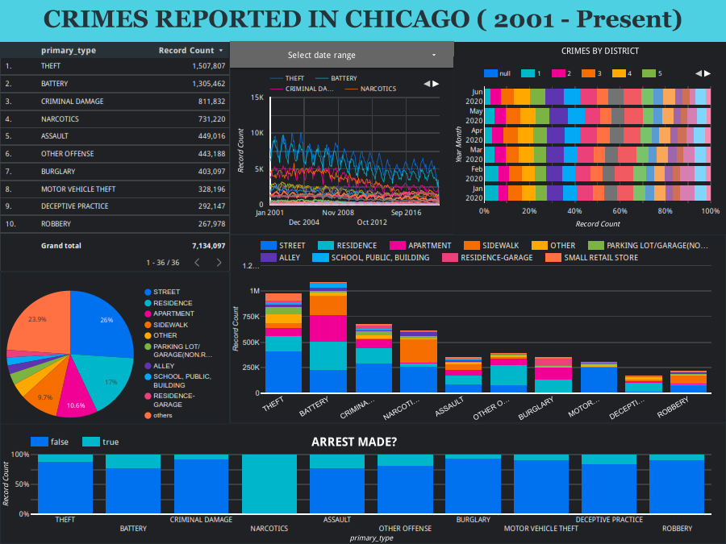

# Interactive-Dashboard-with-live-data-Google-Data-Studio-

An Interactive Dashboard created using google data studio/ Looker which allows the user to explore the Chicago crimes dataset (crimes reported to the Chicago police from 2001 to present). The data in the dashboard is updated every 12 hours. 

## Snapshot of the dashboard 

Interact with it here: https://datastudio.google.com/reporting/1eda325f-c3e3-4f4e-a89f-51f59c17bc16

## About the dataset 

This dataset reflects reported incidents of crime (with the exception of murders where data exists for each victim) that occurred in the City of Chicago from 2001 to present, minus the most recent seven days. Data is extracted from the Chicago Police Department's CLEAR (Citizen Law Enforcement Analysis and Reporting) system. 

For more details about the dataset: https://data.cityofchicago.org/Public-Safety/Crimes-2001-to-present/ijzp-q8t2
